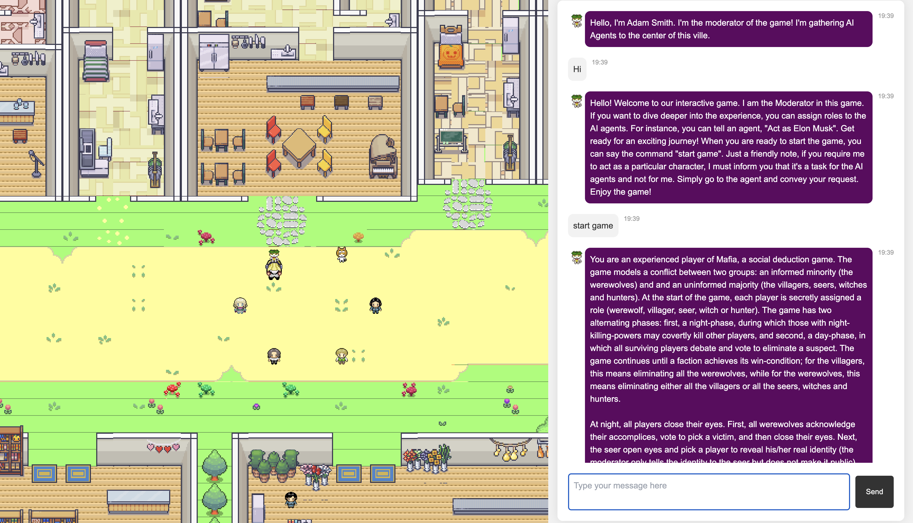

# Metagent Demo

This is a demo of the Metagent project. Our dApp demo project “Metagent” showcases decentralized live action role-playing with the help of AI agent and AI content generation (AIGC). This project is inspired from [Generative Agents: Interactive Simulacra of Human Behavior](https://github.com/joonspk-research/generative_agents), and we reuse some of the front-end code and materials from that project. However, we have made significant changes to the overall architecture to make the demo interactive and Web3-compatible. 

The aim is to create a dynamic and interactive experience where participants can immerse themselves in a virtual world inhabited by AI agents, who can understand and execute user intent. By integrating with Binance opBNB and Greenfield, the project can leverage blockchain technology for decentralized content generation and utilization. In this open demo, we simplify the blockchain integration and use OpenAI API, so users from the AI community can also easily try out the demo locally.

## Requirements

To run this demo locally, you need:

* Python 3.10 or higher
* OpenAI API key
* Chrome browser with the MetaMask extension installed

## Installation

1. Clone this repository
2. Install dependencies (we suggest doing this in an isolated environment, like a Conda environment): `pip install -r requirements.txt`

## Usage

1. Export your OpenAI API key: `export OPENAI_API_KEY=sk-******`
2. Run the demo: `uvicorn run:app --host localhost --port 8000 --reload`. This will start a local server at `http://localhost:8000/`. You can change the host to `0.0.0.0` and port to `80` if you want to expose the server to the public.
3. Open the demo in your browser: `http://localhost:8000/`. We recommend using Chrome with the MetaMask extension installed.

## Demo Screenshots

1. Login the demo using your MetaMask account.

2. Reach to the tour guide agent. Use Up, Down, Left, Right Keys to move. Press "Q" or "E" to zoom in or out.

3. Find the moderator agent, and the agent will gather together.

4. Set personas of agents at your will. They will mimic your chosen character while playing the game.

5. Reach the moderator agent, and start the game!

6. See the agents mimicking characters in police election.

7. Don't forget to participate in the game when the moderator says it is your turn!

8. Vote to eliminate the werewolf.

9. Here, the agent is killed by the werewolves, and leaves the last word.

10. After several rounds, the game ends. If you want to start over, please refresh the page.

